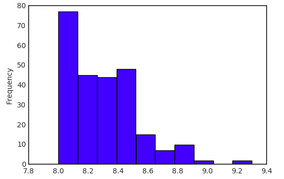
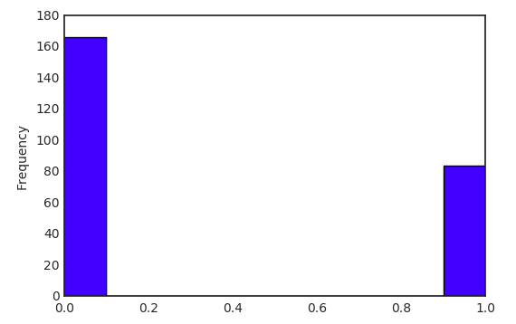
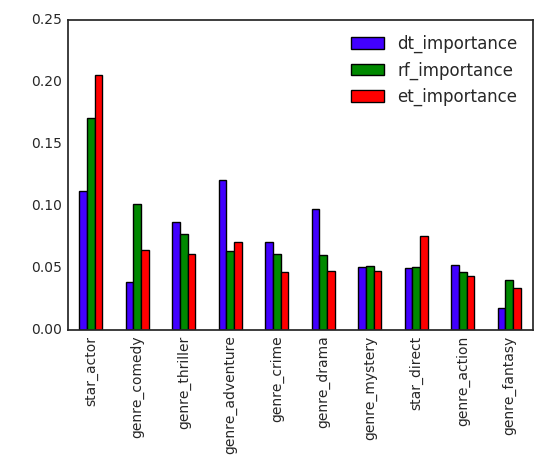
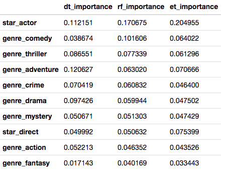
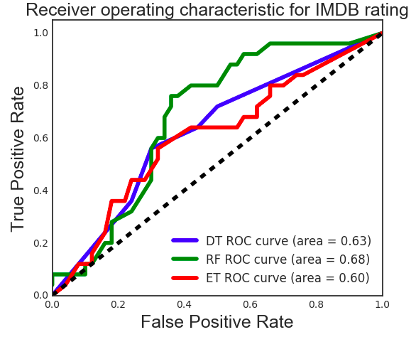
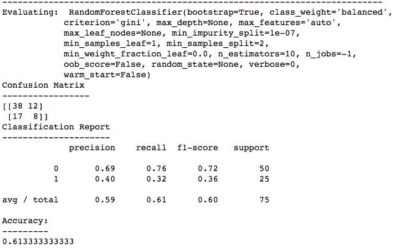

# What Makes a Movie Great?

## The Task
Investigate the Top 250 IMDB Movies and determine what characteristics can predict their high ratings. Hypothesize that a movie can be reasonably well classified as “great” by inspecting its cast, director and genre.

## The Methods
- Obtain 250 “Best Movies of All Time” from IMDB
- Find the median of the ratings
- Create a target that is a “Bin” the ratings either above median or below
- Find subjective lists of
    - 100 greatest actors and actresses (50 male, 50 female)
    - 25 greatest directors
- Create a feature that includes a count of how many of it’s cast (listed in IMDB cast summary) are also in the above lists of best cast.
- Create a feature which denotes whether the movie’s director is in the above director list.
- Create dummy variables for genres.

## The Process
I used OMDB API to obtain the IMDB Top 250 titles along with the subjective lists of great actors and directors. It was decided that the median of the Top 250 Rating score should be used to bin the scores to develop a target for the Tree Based Models. Two new features were created from the subjective lists "Star_Actor" and "Star_Director"

Although several combinations of features were tested, in the end, Star_Actor, Star_Director and dummy-genres were utilized in the model.

## The Models

Three models were tested, DecisionTreeClassifier (dt), RandomForestClassifier (rf) and ExtraTreesClassifier (et). The images below show the feature importance weights for each of the models. You will notice that the most predictive and influential feature is the presence of "Star_Actors", which one might expect.

Using the above features, I was able to test various models. When comparing different classification models, looking at the model's ROC curve and Area Under the Curve (AUC) score is quite helpful.

The desire is to have an AUC of 1.00. This corresponds to having 100% True Positives and no False Positives. The shape of the ideal curve would be to be pulled to the far upper left corner with a long flat plateau to the right corner.

On the curve below, we have plotted 3 different model variants. The RandomForestClassifier seems to provide the best predictions of High/Not-High ratings, but honestly, none are really very good.

In reviewing the confusion matrices, you will see that we are very good at predicting a Not-High rating, but not very good at predicting a High Rating. This is likely due to the very limited sample size which we are working with. 250 Movies is simply not enough to make a robust model.

