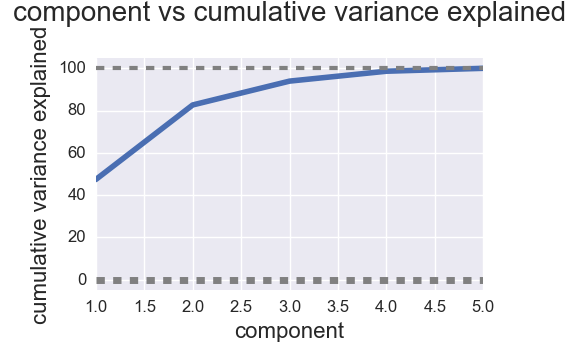

# Slow going in air travel....

## The Task
The aim for this project is to:
 - Uncover the operational factors which are most significant in airport delays.
 - Identify airports that are most impacted by delays.
 - Make recommendations regarding how to decrease delays.

## The Methods
- Explore and analyze the ASPM data provided
- Utilize Principle Component Analysis (PCA) to distill several features to fewer
- Perform unsupervised cluster analysis to seek out patterns in the data.

## The Process
I first needed a better understanding of the data from an operational point of view. I researched the definitions of the data provided
based on the information available at the [ASPM website](http://aspmhelp.faa.gov/index.php/ASPM_Airport_Analysis:_Definitions_of_Variables).
Next I decided on which features were most likely to provide information regarding the contributing factors of delays. I felt
comfortable in using the following 5 features because they were all specifically measures of delay and not a straight time measurement:
  - average_gate_departure_delay    
  - average_taxi_out_delay         
  - average_airborne_delay         
  - average_taxi_in_delay          
  - average_gate_arrival_delay  

## The PCA

In order to reduce the complexity of the features, based on the correlation between some of my key features (see heatmaps below), I decided that a Principle Component Analysis would be a reasonable way to proceed.

I performed the PCA using a component value of 3. The results of the PCA demonstrated that, indeed, 94% of my variance could be explained by 3 components.

